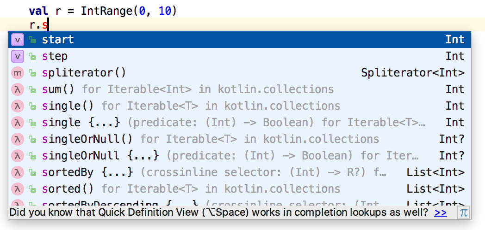

# 到处都是对象

> 对象使用属性（`val` 和 `var`）存储数据，并使用函数执行与此数据相关的操作。

一些定义：

- *类*：为基本上是新数据类型的内容定义属性和函数。类也被称为*用户定义类型*。
- *成员*：类的属性或函数。
- *成员函数*：仅适用于特定类对象的函数。
- *创建对象*：创建类的 `val` 或 `var`。也称为该类的*实例化*。

因为类定义了*状态*和*行为*，我们甚至可以将内置类型（如 `Double` 或 `Boolean`）的实例称为对象。

考虑 Kotlin 的 `IntRange` 类：

```kotlin
// ObjectsEverywhere/IntRanges.kt

fun main() {
  val r1 = IntRange(0, 10)
  val r2 = IntRange(5, 7)
  println(r1)
  println(r2)
}
/* 输出:
0..10
5..7
*/
```

我们创建了两个 `IntRange` *类*的对象（实例）。每个对象在内存中有自己的存储空间。`IntRange` 是一个类，但是从 0 到 10 的特定范围 `r1` 是一个与范围 `r2` 不同的对象。

`IntRange` 对象有许多操作可用。有些操作很简单，比如 `sum()`，而其他操作则需要更多的理解才能使用。如果尝试调用需要参数的操作，IDE 将要求提供这些参数。

要了解特定的成员函数，可以在 [Kotlin 文档](https://kotlinlang.org/api/latest/jvm/stdlib/index.html) 中查找。注意页面右上角的放大镜图标。点击该图标，然后在搜索框中键入 `IntRange`。从搜索结果中点击 `kotlin.ranges > IntRange`。您将看到 `IntRange` 类的文档。您可以学习该类的所有成员函数（*应用程序编程接口*，API）。尽管现在大部分内容您可能不会理解，但习惯于在 Kotlin 文档中查找信息是有帮助的。

`IntRange` 是一种对象，而对象的一个定义特性是你可以对其执行操作。我们不再说“执行一个操作”，而是说*调用一个成员函数*。要为对象调用成员函数，请从对象标识符开始，然后是一个点，然后是操作的名称：

```kotlin
// ObjectsEverywhere/RangeSum.kt

fun main() {
  val r = IntRange(0, 10)
  println(r.sum())
}
/* 输出:
55
*/
```

因为 `sum()` 是为 `IntRange` 定义的成员函数，所以通过 `r.sum()` 来调用它。这会将 `IntRange` 中的所有数字相加。

早期的面向对象语言使用“发送消息”这个短语来描述为对象调用成员函数的操作。有时你仍然会看到这种术语。

类可以有许多操作（成员函数）。通过包含名为*代码补全*的功能的集成开发环境（IDE），可以轻松地探索类。例如，如果在 IntelliJ IDEA 中在对象标识符后键入 `.s`，它将显示以 `s` 开头的该对象的所有成员：

<div align="center">
  
  <p>代码补全</p>
</div>

尝试在其他对象上使用代码补全。例如，您可以反转一个 `String` 或将所有字符转换为小写：

```kotlin
// ObjectsEverywhere/Strings.kt

fun main() {
  val s = "AbcD"
  println(s.reversed())
  println(s.toLowerCase())
}
/* 输出:
DcbA
abcd
*/
```

您还可以轻松将 `String` 转换为整数，然后再转换回去：

```kotlin
// ObjectsEverywhere/Conversion.kt

fun main() {
  val s = "123"
  println(s.toInt())
  val i = 123
  println(i.toString())
}
/* 输出:
123
123
*/
```

在本书后面，我们将讨论处理将 `String` 转换为不正确整数值的情况的策略。

您还可以从一种数值类型转换为另一种。为了避免混淆，数值类型之间的转换是显式的。例如，您可以通过调用 `i.toLong()` 将 `Int i` 转换为 `Long`，或者通过 `i.toDouble()` 转换为 `Double`：

```kotlin
// ObjectsEverywhere/NumberConversions.kt

fun fraction(numerator: Long, denom: Long) =
  numerator.toDouble() / denom

fun main() {
  val num = 1
  val den = 2
  val f = fraction(num.toLong(), den.toLong())
  println(f)
}
/* 输出:
0.5
*/
```

良好定义的类对程序员来说易于理解，并产生易于阅读的代码。

***练习和解答可以在 www.AtomicKotlin.com 找到。***