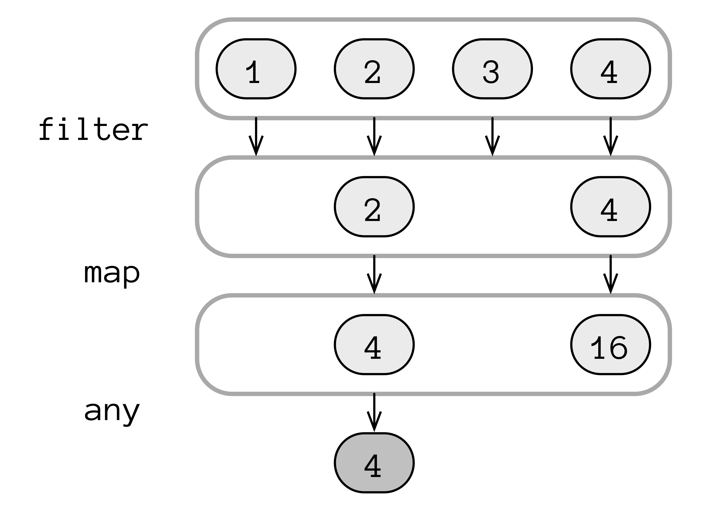
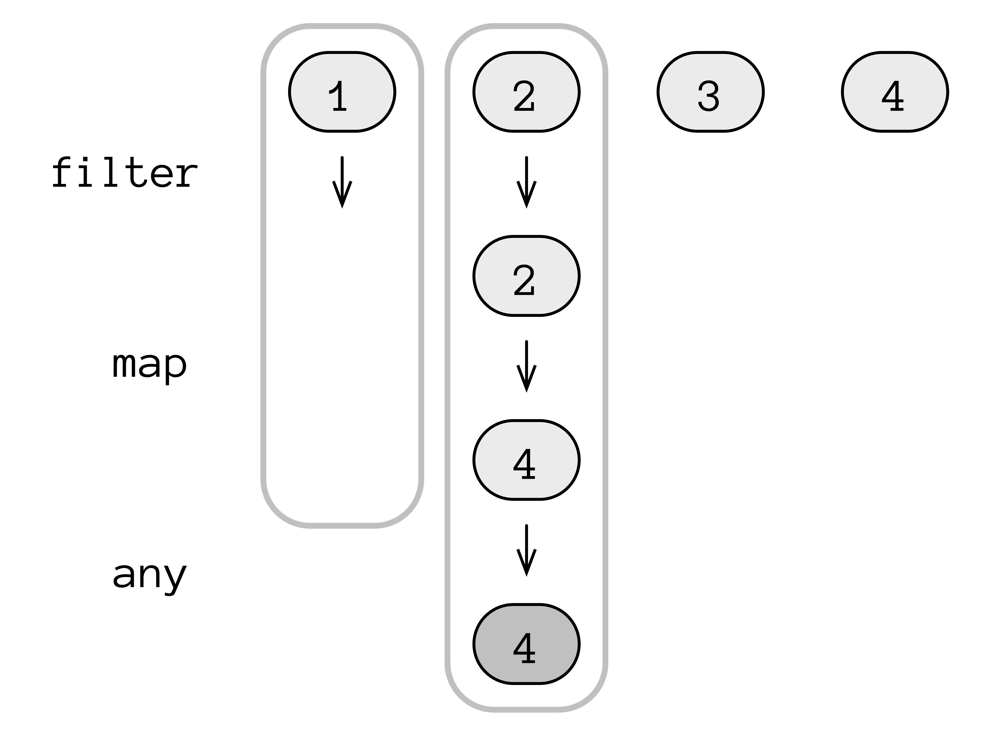

# 序列

> Kotlin 的 `Sequence` 类似于 `List`，但您只能迭代遍历 `Sequence`，不能对 `Sequence` 进行索引。这个限制产生了非常高效的链式操作。

在其他函数式语言中，Kotlin 的 `Sequence` 被称为 *流*（stream）。Kotlin 必须选择一个不同的名称，以保持与 Java 8 的 `Stream` 库的互操作性。

对 `List` 的操作是*急切*（eager）执行的，它们总是立即执行的。在链接 `List` 操作时，必须在开始下一个操作之前生成第一个结果。在下面的示例中，每个 `filter()`、`map()` 和 `any()` 操作都应用于 `list` 中的每个元素：

```kotlin
// Sequences/EagerEvaluation.kt
import atomictest.eq

fun main() {
  val list = listOf(1, 2, 3, 4)

  list.filter { it % 2 == 0 }
    .map { it * it }
    .any { it < 10 } eq true

  // 相当于：
  val mid1 = list.filter { it % 2 == 0 }
  mid1 eq listOf(2, 4)
  val mid2 = mid1.map { it * it }
  mid2 eq listOf(4, 16)
  mid2.any { it < 10 } eq true
}
```

急切求值是直观而简单的，但可能不太优化。在 `EagerEvaluation.kt` 中，遇到满足 `any()` 的第一个元素后停止会更有意义。对于长序列，这种优化可能比计算每个元素然后搜索单个匹配要快得多。

急切求值有时被称为*水平求值*：

<div align="center">
    
  <p>水平求值</p>  
</div>

第一行包含初始列表内容。每一行后面都显示了上一个操作的结果。在执行下一个操作之前，会处理当前水平级别上的所有元素。

急切求值的替代方案是*惰性求值*：只有在需要时才计算结果。在序列上执行惰性操作有时被称为*垂直求值*：

<div align="center">
  
  <p>垂直求值</p>
</div>

使用惰性求值，仅当请求某个元素的关联结果时才对该元素执行操作。如果在处理最后一个元素之前找到了计算的最终结果，那么不会再处理更多的元素。

通过使用 `asSequence()` 将 `List` 转换为 `Sequence`，可以实现惰性求值。除索引之外，所有 `List` 操作也适用于 `Sequence`，因此通常可以进行这个单一的改变，并获得惰性求值的好处。

下面的示例将上述图示转换为代码。我们首先在 `List` 上执行相同的一系列操作，然后在 `Sequence` 上执行。输出显示了每个操作的调用位置：

```kotlin
// Sequences/EagerVsLazyEvaluation.kt
package sequences
import atomictest.*

fun Int.isEven(): Boolean {
  trace("$this.isEven()")
  return this % 2 == 0
}

fun Int.square(): Int {
  trace("$this.square()")
  return this * this
}

fun Int.lessThanTen(): Boolean {
  trace("$this.lessThanTen()")
  return this < 10
}

fun main() {
  val list = listOf(1, 2, 3, 4)
  trace(">>> List:")
  trace(
    list
      .filter(Int::isEven)
      .map(Int::square)
      .any(Int::lessThanTen)
  )
  trace(">>> Sequence:")
  trace(
    list.asSequence()
      .filter(Int::isEven)
      .map(Int::square)
      .any(Int::lessThanTen)
  )
  trace eq """
    >>> List:
    1.isEven()
    2.isEven()
    3.isEven()
    4.isEven()
    2.square()
    4.square()
    4.lessThanTen()
    true
    >>> Sequence:
    1.isEven()
    2.isEven()
    2.square()
    4.lessThanTen()
    true
  """
}
```

两种方法之间唯一的区别是添加了 `asSequence()` 调用，但是 `List` 代码会处理更多的元素。

在 `Sequence` 上调用 `filter()` 或 `map()` 会产生另一个 `Sequence`。在从计算中请求结果之前，什么都不会发生。相反，新的 `Sequence` 存储了有关延迟操作的所有信息，并且只有在需要时才执行这些操作：

```kotlin
// Sequences/NoComputationYet.kt
import atomictest.eq
import sequences.*

fun main() {
  val r = listOf(1, 2, 3, 4)
    .asSequence()
    .filter(Int::isEven)
    .map(Int::square)
  r.toString().substringBefore("@") eq
    "kotlin.sequences.TransformingSequence"
}
```

将 `r` 转换为字符串不会产生所需的结果，而只会产生对象的标识符（包括内存中对象的 `@` 地址，我们使用标准库的 `substringBefore()` 删除它）。`TransformingSequence` 只保存操作，但不执行它们。

`Sequence` 操作分为两类：*中间操作* 和 *终端操作*。中间操作返回另一个 `Sequence` 作为结果。`filter()` 和 `map()` 是中间操作。终端操作返回一个非 `Sequence`。为了实现这一点，终端操作会执行所有存储的计算。在前面的示例中，`any()` 是终端操作，因为它接受一个 `Sequence` 并返回一个 `Boolean`。在下面的示例中，`

toList()` 是终端操作，因为它将 `Sequence` 转换为 `List`，在此过程中运行所有存储的操作：

```kotlin
// Sequences/TerminalOperations.kt
import sequences.*
import atomictest.*

fun main() {
  val list = listOf(1, 2, 3, 4)
  trace(list.asSequence()
    .filter(Int::isEven)
    .map(Int::square)
    .toList())
  trace eq """
    1.isEven()
    2.isEven()
    2.square()
    3.isEven()
    4.isEven()
    4.square()
    [4, 16]
  """
}
```

由于 `Sequence` 存储操作，它可以以任何顺序调用这些操作，从而实现惰性求值。

下面的示例使用标准库函数 `generateSequence()` 生成一个无限自然数序列。第一个参数是序列中的初始元素，后面跟着一个定义如何从上一个元素计算下一个元素的 lambda：

```kotlin
// Sequences/GenerateSequence1.kt
import atomictest.eq

fun main() {
  val naturalNumbers =
    generateSequence(1) { it + 1 }
  naturalNumbers.take(3).toList() eq
    listOf(1, 2, 3)
  naturalNumbers.take(10).sum() eq 55
}
```

`Collection` 具有已知大小，可以通过其 `size` 属性发现。`Sequence` 被视为无限大。在这里，我们使用 `take()` 来决定需要多少个元素，然后是终端操作（`toList()` 或 `sum()`）。

`generateSequence()` 还有一个重载版本，不需要第一个参数，只需要一个返回序列中下一个元素的 lambda。当没有更多元素时，它会返回 `null`。下面的示例生成一个 `Sequence`，直到输入中出现“终止标志” `XXX`：

```kotlin
// Sequences/GenerateSequence2.kt
import atomictest.*

fun main() {
  val items = mutableListOf(
    "first", "second", "third", "XXX", "4th"
  )
  val seq = generateSequence {
    items.removeAt(0).takeIf { it != "XXX" }
  }
  seq.toList() eq "[first, second, third]"
  capture {
    seq.toList()
  } eq "IllegalStateException: This " +
    "sequence can be consumed only once."
}
```

`removeAt(0)` 从 `List` 中删除并生成零索引位置的元素。`takeIf()` 如果满足给定的谓词，则返回接收者（由 `removeAt(0)` 生成的 `String`），如果谓词失败（当 `String` 为 `"XXX"` 时），则返回 `null`。

您只能对 `Sequence` 进行一次迭代。进一步的尝试会产生异常。要通过 `Sequence` 进行多次遍历，请首先将其转换为某种类型的 `Collection`。

下面是 `takeIf()` 的实现，使用泛型 `T` 定义，以便可以与任何类型的参数一起使用：

```kotlin
// Sequences/DefineTakeIf.kt
package sequences
import atomictest.eq

fun <T> T.takeIf(
  predicate: (T) -> Boolean
): T? {
  return if (predicate(this)) this else null
}

fun main() {
  "abc".takeIf { it != "XXX" } eq "abc"
  "XXX".takeIf { it != "XXX" } eq null
}
```

在这里，`generateSequence()` 和 `takeIf()` 生成一个递减的数字序列：

```kotlin
// Sequences/NumberSequence2.kt
import atomictest.eq

fun main() {
  generateSequence(6) {
    (it - 1).takeIf { it > 0 }
  }.toList() eq listOf(6, 5, 4, 3, 2, 1)
}
```

普通的 `if` 表达式始终可以用作 `takeIf()` 的替代方案，但是引入额外的标识符可能会使 `if` 表达式变得笨拙。`takeIf()` 版本更加功能化，特别是如果它作为一系列调用的一部分使用。

***练习和解答可以在 www.AtomicKotlin.com 找到。***