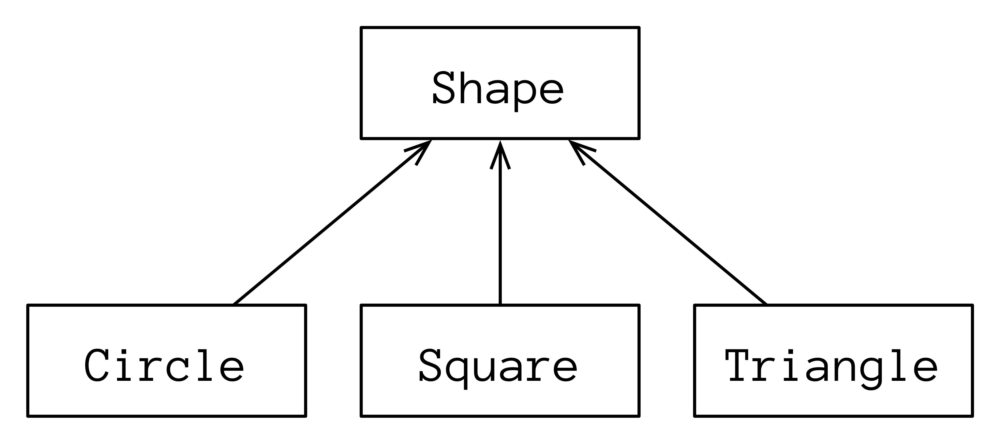

# 向上转型

> 将对象引用视为其基础类型引用被称为*向上转型*。术语*向上转型*指的是继承层次结构通常以基类位于顶部，派生类从下方分支出的方式。

继承并添加新成员函数是 Smalltalk 的一种实践，它是最早成功的面向对象语言之一。在 Smalltalk 中，一切都是对象，创建类的唯一方法是从现有类继承，通常会添加新的成员函数。Smalltalk 对 Java 产生了很大影响，Java 也要求一切都是对象。

Kotlin 解放了我们的束缚。我们拥有独立的函数，因此不必将所有内容都包含在类中。扩展函数允许我们在不使用继承的情况下添加功能。实际上，要求使用 `open` 关键字进行继承使得继承成为一个非常明确和有意识的选择，而不是随时都可以使用的东西。

更准确地说，它将继承缩小到一个非常特定的用途，这种抽象允许我们编写可以在单个层次结构内的多个类之间重用的代码。[多态性](se05-ch08.md) 这一节探讨了这些机制，但首先您必须理解向上转型。

考虑一些可以绘制和擦除的 `Shape`（形状）：

```kotlin
// Upcasting/Shapes.kt
package upcasting

interface Shape {
  fun draw(): String
  fun erase(): String
}

class Circle : Shape {
  override fun draw() = "Circle.draw"
  override fun erase() = "Circle.erase"
}

class Square : Shape {
  override fun draw() = "Square.draw"
  override fun erase() = "Square.erase"
  fun color() = "Square.color"
}

class Triangle : Shape {
  override fun draw() = "Triangle.draw"
  override fun erase() = "Triangle.erase"
  fun rotate() = "Triangle.rotate"
}
```

`show()` 函数接受任何 `Shape`：

```kotlin
// Upcasting/Drawing.kt
package upcasting
import atomictest.*

fun show(shape: Shape) {
  trace("Show: ${shape.draw()}")
}

fun main() {
  listOf(Circle(), Square(), Triangle())
    .forEach(::show)
  trace eq """
    Show: Circle.draw
    Show: Square.draw
    Show: Triangle.draw
  """
}
```

在 `main()` 中，`show()` 使用三种不同的类型进行了调用：`Circle`、`Square` 和 `Triangle`。`show()` 参数的基类是 `Shape`，因此 `show()` 接受这三种类型。这些类型中的每一个都被视为基本 `Shape` —— 我们说特定的类型被*向上转型*为基本类型。

我们通常将绘图层次结构绘制成具有基类的图表：

<div align="center">
  
  <p>形状层次结构</p>
</div>

当我们将 `Circle`、`Square` 或 `Triangle` 作为 `Shape` 类型的参数传递给 `show()` 时，我们*向上*转型了这个继承层次结构。在向上转型的过程中，我们失去了关于对象是 `Circle`、`Square` 还是 `Triangle` 类型的具体信息。在每种情况下，它不过是一个 `Shape` 对象而已。

将特定类型视为更一般类型正是继承的全部目的。继承的机制存在的唯一目的就是实现向上转型到基本类型的目标。由于这种抽象（“一切都是 `Shape`”），我们可以编写一个单一的 `show()` 函数，而不是为每种类型的元素编写一个函数。向上转型是重用对象代码的一种方式。

实际上，在几乎所有没有向上转型的继承的情况下，继承都被误用了——它是不必要的，会使代码变得复杂。这种误用是以下原则的原因：

> *优先使用组合而不是继承。*

如果继承的目的是能够将派生类型替换为基本类型，那么派生类中的额外成员函数会发生什么情况：`Square` 中的 `color()` 和 `Triangle` 中的 `rotate()`？

*可替代性*，也称为 *Liskov 替换原则*，表示在向上转型后，派生类型可以像基本类型一样被处理 —— 既不多也不少。这意味着添加到派生类的任何成员函数实际上都会“被修剪掉”。它们仍然存在，但因为它们不是基类接口的一部分，所以在 `show()` 中无法使用它们：

```kotlin
// Upcasting/TrimmedMembers.kt
package upcasting
import atomictest.*

fun trim(shape: Shape) {
  trace(shape.draw())
  trace(shape.erase())
  // 不会编译通过：
  // shape.color()    // [1]
  // shape.rotate()   // [2]
}

fun main() {
  trim(Square())
  trim(Triangle())
  trace eq """
    Square.draw
    Square.erase
    Triangle.draw
    Triangle.erase
  """
}
```

您无法在第 **[1]** 行调用 `color()`，因为 `Square` 实例被向上转型为 `Shape`，并且您无法在第 **[2]** 行调用 `rotate()`，因为 `Triangle` 实例也被向上转型为 `Shape`。只有那些在 *所有* `Shape` 中都共同存在的成员函数可用 —— 即在基本类型 `Shape` 中定义

的那些函数。

请注意，当您将 `Shape` 的子类型直接赋值给一般的 `Shape` 类型时，也是一样的。指定的类型决定了可用的成员：

```kotlin
// Upcasting/Assignment.kt
import upcasting.*

fun main() {
  val shape1: Shape = Square()
  val shape2: Shape = Triangle()
  // 不会编译通过：
  // shape1.color()
  // shape2.rotate()
}
```

向上转型后，只能调用基类的成员。

***练习和解答可以在 www.AtomicKotlin.com 找到。***