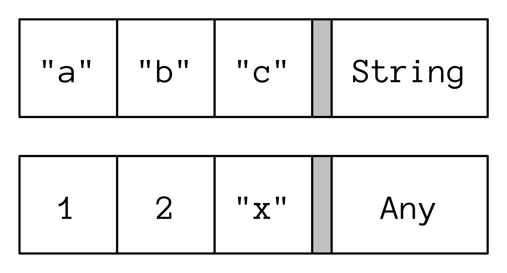

# 创建泛型

> 泛型代码可以与“稍后指定的类型”一起工作。

普通的类和函数适用于特定的类型。如果您希望代码适用于更多类型，这种刚性可能过于约束性。

[多态](se05-ch08.md) 是一种面向对象的泛化工具。您编写一个接受基类对象作为参数的函数，然后使用来自该基类派生的任何类的对象调用该函数，包括尚未创建的类。现在，您的函数变得更加通用，在更多地方变得有用。

单个继承层次结构可能过于局限，因为您必须从该继承层次结构中继承以生成适合函数参数的对象。如果函数参数是接口而不是类，则限制会放松，以包括任何实现该接口的内容。这使客户程序员有机会在现有类与接口的组合中实现接口，即将现有类“适配”到函数中。以这种方式使用接口可以跨类层次结构。

有时，甚至接口也过于限制，因为它强制您只能使用该接口。如果代码与“某种未指定的类型”一起工作，而不是特定的接口或类，那么您的代码可以更加通用。这个“未指定的类型”是 *泛型类型参数*。

创建泛型类型和函数是一个相当复杂的主题，其中大部分内容超出了本书的范围。这篇文章试图为您提供足够的背景，以便在遇到泛型概念和关键字时不会感到惊讶。如果您想认真编写泛型类型和函数，您需要学习更高级的资源。

###   `Any`

`Any` 是 Kotlin 类层次结构的根。每个 Kotlin 类都有 `Any` 作为其超类。一种处理未指定类型的方法是通过传递 `Any` 参数来实现的，这有时可能会混淆何时使用泛型。如果 `Any` 可行，它是更简单的解决方案，而简单通常更好。

使用 `Any` 有两种方法。第一种方法是当您只需要对 `Any` 进行操作，仅此而已。这非常有限 - `Any` 仅具有三个成员函数：`equals()`、`hashCode()` 和 `toString()`。还有扩展函数，但这些函数无法对类型执行任何直接操作。例如，`apply()` 仅将其函数参数应用于 `Any`。

如果您知道 `Any` 的类型，可以将其转换并执行特定于类型的操作。因为这涉及运行时类型信息（如[向下转型](se05-ch12.md)所示），所以如果将错误类型传递给函数，就会产生运行时错误（还会有轻微的性能影响）。有时，为了消除代码重复，这是合理的。

例如，假设三种类型都有通信的能力。它们来自不同的库，因此您不能将它们放在同一个层次结构中，并且它们具有不同的通信函数名称：

```kotlin
// CreatingGenerics/Speakers.kt
package creatinggenerics
import atomictest.eq

class Person {
  fun speak() = "Hi!"
}

class Dog {
  fun bark() = "Ruff!"
}

class Robot {
  fun communicate() = "Beep!"
}

fun talk(speaker: Any) = when (speaker) {
  is Person -> speaker.speak()
  is Dog -> speaker.bark()
  is Robot -> speaker.communicate()
  else -> "Not a talker" // Or exception
}

fun main() {
  talk(Person()) eq "Hi!"
  talk(Dog()) eq "Ruff!"
  talk(Robot()) eq "Beep!"
  talk(11) eq "Not a talker"
}
```


`when` 表达式发现了 `speaker` 的类型并调用了适当的函数。如果您认为 `talk()` 永远不需要与其他类型一起工作，那么这是一个可以容忍的解决方案。否则，它要求您为每种添加的新类型修改 `talk()`，并且依赖于运行时信息来发现何时遗漏了某些内容。

### 定义泛型

重复的代码可以转换为泛型函数或类型。您可以通过添加带有一个或多个泛型占位符的尖括号（`<>`）来实现此目的。在这里，泛型占位符 `T` 代表未知类型：

```kotlin
// CreatingGenerics/DefiningGenerics.kt
package creatinggenerics

fun <T> gFunction(arg: T): T = arg

class GClass<T>(val x: T) {
  fun f(): T = x
}

class GMemberFunction {
  fun <T> f(arg: T): T = arg
}

interface GInterface<T> {
  val x: T
  fun f(): T
}

class GImplementation<T>(
  override val x: T
) : GInterface<T> {
  override fun f(): T = x
}

class ConcreteImplementation
  : GInterface<String> {
  override val x: String
    get() = "x"
  override fun f() = "f()"
}

fun basicGenerics() {
  gFunction("Yellow")
  gFunction(1)
  gFunction(Dog()).bark()            // [1]
  gFunction<Dog>(Dog()).bark()

  GClass("Cyan").f()
  GClass(11).f()
  GClass(Dog()).f().bark()           // [2]
  GClass<Dog>(Dog()).f().bark()

  GMemberFunction().f("Amber")
  GMemberFunction().f(111)
  GMemberFunction().f(Dog()).bark()  // [3]
  GMemberFunction().f<Dog>(Dog()).bark()

  GImplementation("Cyan").f()
  GImplementation(11).f()
  GImplementation(Dog()).f().bark()

  ConcreteImplementation().f()
  ConcreteImplementation().x
}
```

`basicGenerics()` 显示了每个泛型如何处理不同类型：

- `gFunction()` 接受类型为 `T` 的参数并返回类型为 `T` 的结果。
- `GClass` 存储 `T`。其成员函数 `f()` 返回 `T`。
- `GMemberFunction` 在类内部参数化成员函数，而不是在整个类内部参数化。
- 您还可以定义具有泛型参数的 `interface`，如 `GInterface` 所示。`GInterface` 的实现可以重新定义类型参数，如 `GImplementation` 所示，也可以提供特定的类型参数，如 `ConcreteImplementation` 所示。

注意在 **[1]**、**[2]** 和 **[3]** 中，我们能够在结果上调用 `bark()`，因为该结果出现为类型 `Dog`。

考虑 **[1]**、**[2]** 和 **[3]**，以及紧随其后的行。类型 `T` 是通过 **[1]**、**[2]** 和 **[3]** 的类型推断确定的。有时，如果泛型或其调用过于复杂，编译器无法解析它，则无法确定类型（类型推断）。在这种情况下，必须使用紧随 **[1]**、**[2]** 和 **[3]** 的行中所示的语法指定类型。

### 保留类型信息

正如您将在本文档后面看到的那样，泛型类和函数中的代码无法知道 `T` 的类型 - 这称为 *擦除*。泛型可以被认为是一种保留返回值类型信息的方式。这样，您就不必编写代码来显式检查和将返回值强制转换为所需的类型。

泛型代码的一个常见用途是用于保存其他对象的容器。考虑一个 `CarCrate` 类，它作为一个简单的集合，通过保存和生成一个类型为 `Car` 的单个元素来运作：

```kotlin
// CreatingGenerics/CarCrate.kt
package creatinggenerics
import atomictest.eq

class Car {
  override fun toString() = "Car"
}

class CarCrate(private var c: Car) {
  fun put(car: Car) { c = car }
  fun get(): Car = c
}

fun main() {
  val cc = CarCrate(Car())
  val car: Car = cc.get()
  car eq "Car"
}
```

当我们调用 `cc.get()` 时，结果以类型 `Car` 返回。我们想要将此工具提供给比仅仅是 `Car` 的更多对象，因此我们将这个类泛化为 `Crate<T>`：

```kotlin
// CreatingGenerics/Crate.kt
package creatinggenerics
import atomictest.eq

open class Crate<T>(private var contents: T) {
  fun put(item: T) { contents = item }
  fun get(): T = contents
}

fun main() {
  val cc = Crate(Car())
  val car: Car = cc.get()
  car eq "Car"
}
```

`Crate<T>` 确保只能将 `T` 放入 `Crate`，并且在对该 `Crate` 调用 `get()` 时，结果以类型 `T` 返回。

我们可以通过定义一个泛型扩展函数来为 `Crate` 制作一个 `map()` 版本：

```kotlin
// CreatingGenerics/MapCrate.kt
package creatinggenerics
import atomictest.eq

fun <T, R> Crate<T>.map(f:(T) -> R): List<R> =
  listOf(f(get()))

fun main() {
  Crate(Car()).map { it.toString() + "x" } eq
    "[Carx]"
}
```

`map()` 返回通过将 `f()` 应用于输入序列中的每个元素而产生的结果的 `List`。由于 `Crate` 仅包含一个元素，因此结果始终是一个只包含一个元素的 `List`。有两个泛型参数：`T` 用于输入值，`R` 用于结果，允许 `f()` 生成与输入类型不同的结果类型。

### 类型参数约束

*类型参数约束* 表示泛型参数类型必须从约束继承。`<T : Base>` 表示 `T` 必须是类型 `Base` 或从 `Base` 派生的类型。本节展示了使用约束与继承 `Base` 的非泛型类型是不同的。

考虑一种类型层次结构，该层次结构模拟了不同的物品以及处理它们的方式：

```kotlin
// CreatingGenerics/Disposable.kt
package creatinggenerics
import atomictest.eq

interface Disposable {
  val name: String
  fun action(): String
}

class Compost(override val name: String) :
  Disposable {
  override fun action() = "Add to composter"
}

interface Transport : Disposable

class Donation(override val name: String) :
  Transport {
  override fun action() = "Call for pickup"
}

class Recyclable(override val name: String) :
  Transport {
  override fun action() = "Put in bin"
}

class Landfill(override val name: String) :
  Transport {
  override fun action() = "Put in dumpster"
}

val items = listOf(
  Compost("Orange Peel"),
  Compost("Apple Core"),
  Donation("Couch"),
  Donation("Clothing"),
  Recyclable("Plastic"),
  Recyclable("Metal"),
  Recyclable("Cardboard"),
  Landfill("Trash"),
)

val recyclables =
  items.filterIsInstance<Recyclable>()
```

通过约束，我们可以在泛型函数内访问约束类型的属性和函数：

```kotlin
// CreatingGenerics/Constrained.kt
package creatinggenerics
import atomictest.eq

fun <T: Disposable> nameOf(disposable: T) =
  disposable.name

// 作为扩展：
fun <T: Disposable> T.name() = name

fun main() {
  recyclables.map { nameOf(it) } eq
    "[Plastic, Metal, Cardboard]"
  recyclables.map { it.name() } eq
    "[Plastic, Metal, Cardboard]"
}
```

我们不能在没有约束的情况下访问 `name`。

这实现了相同的结果，但不使用泛型约束：

```kotlin
// CreatingGenerics/NonGenericConstraint.kt
package creatinggenerics
import atomictest.eq

fun nameOf2(disposable: Disposable) =
  disposable.name

fun Disposable.name2() = name

fun main() {
  recyclables.map { nameOf2(it) } eq
    "[Plastic, Metal, Cardboard]"
  recyclables.map { it.name2() } eq
  "[Plastic, Metal, Cardboard]"
}
```

为什么要使用约束而不是普通的多态性？答案在于返回类型。使用泛型时，返回类型可以是精确的，而不是将其向上转换为基础类型：

```kotlin
// CreatingGenerics/SameReturnType.kt
package creatinggenerics
import kotlin.random.Random

private val rnd = Random(47)

fun List<Disposable>.aRandom(): Disposable =
  this[rnd.nextInt(size)]

fun <T: Disposable> List<T>.bRandom(): T =
  this[rnd.nextInt(size)]

fun <T> List<T>.cRandom(): T =
  this[rnd.nextInt(size)]

fun sameReturnType() {
  val a: Disposable = recyclables.aRandom()
  val b: Recyclable = recyclables.bRandom()
  val c: Recyclable = recyclables.cRandom()
}
```

在没有泛型的情况下，`aRandom()` 只能生成一个基类 `Disposable`，而

 `bRandom()` 和 `cRandom()` 都生成一个 `Recyclable`。`bRandom()` 从不访问 `T` 的任何元素，因此它的约束是无意义的，最终它与不使用约束的 `cRandom()` 相同，后者不使用约束。

只有在满足以下 *两个* 条件时，您才需要约束：

1. 访问函数或属性。
2. 保留在返回时的类型。

```kotlin
// CreatingGenerics/Constraints.kt
package creatinggenerics
import kotlin.random.Random

private val rnd = Random(47)

// 访问 action() 但不能
// 返回确切的类型：
fun List<Disposable>.inexact(): Disposable {
  val d: Disposable = this[rnd.nextInt(size)]
  d.action()
  return d
}

// 不能在没有约束的情况下访问 action()：
fun <T> List<T>.noAccess(): T {
  val d: T = this[rnd.nextInt(size)]
  // d.action()
  return d
}

// 访问 action() 并返回确切的类型：
fun <T: Disposable> List<T>.both(): T {
  val d: T = this[rnd.nextInt(size)]
  d.action()
  return d
}

fun constraints() {
  val i: Disposable = recyclables.inexact()
  val n: Recyclable = recyclables.noAccess()
  val b: Recyclable = recyclables.both()
}
```

### 类型擦除

Java 的兼容性是 Kotlin 的一个重要部分。在 Java 中，泛型不是原始语言的一部分 - 它们是在许多代码已经编写后的几年后添加的。将泛型强行引入 Java 而不破坏现有代码需要一个重要的妥协：泛型类型仅在编译期间可用，但在运行时不保留类型 - 类型被 *擦除*。这个 *擦除* 影响了 Kotlin。

让我们假设不会发生擦除：

```kotlin
// CreatingGenerics/Erasure.kt
package creatinggenerics

fun main() {
  val strings = listOf("a", "b", "c")
  val all: List<Any> = listOf(1, 2, "x")
  useList(strings)
  useList(all)
}

fun useList(list: List<Any>) {
  // if (list is List<String>) {}  // [1]
}
```

取消注释 **[1]** 行，您会看到以下错误：“Cannot check for instance of erased type: `List<String>`”。您无法在运行时检查泛型类型，因为类型信息已被擦除。

如果擦除 *没有发生*，列表可能如下所示，假设附加的类型信息放在列表末尾（实际上**不是**这样工作的！）：

<div align="center">
  
  <p>具体化的泛型</p>
</div>

因为泛型类型被擦除，类型信息 *不会* 存储在 `List` 中。相反，`strings` 和 `all` 都只是 `List`，没有附加的类型信息：

<div align="center">
  
  <p>擦除的泛型</p>
</div>

您无法从 `List` 的内容中猜测出类型信息，而不需要分析所有元素。仅检查第二个列表的第一个元素会让您错误地认为它是 `List<Int>`。

Kotlin 设计者决定遵循 Java 并使用擦除，原因有两点：

1. Java 兼容性。
2. 开销。存储泛型类型信息会显著增加泛型 `List` 或 `Map` 占用的内存。例如，标准的 `Map` 由许多 `Map.Entry` 对象组成，而 `Map.Entry` 是一个泛型类。因此，如果默认情况下在每个 `Map.Entry` 的键和值中都包含附加的类型信息，每个 `Map.Entry` 都会包含额外的类型信息。

### 泛型函数类型参数的具体化

泛型函数调用的类型信息也会被擦除，这意味着您无法在函数内部对泛型参数做太多操作。

要保留函数参数的类型信息，可以添加 `reified` 关键字。考虑一个需要类信息来执行任务的函数 `a()`：

```kotlin
// CreatingGenerics/ReificationA.kt
package creatinggenerics
import kotlin.reflect.KClass

fun <T: Any> a(kClass: KClass<T>) {
  // 使用 KClass<T>
}
```

当我们在第二个泛型函数 `b()` 内调用 `a()` 时，我们希望在泛型参数的类型信息中使用：

```kotlin
// CreatingGenerics/ReificationB.kt
package creatinggenerics

// 由于类型擦除，无法编译：
// fun <T: Any> b() = a(T::class)
```

当这段代码运行时，`T` 的类型信息被擦除，因此 `b()` 将无法编译。您无法在函数体内访问泛型类型参数的类。

Java 的解决方案是手动将类型信息传递到函数内部：

```kotlin
// CreatingGenerics/ReificationC.kt
package creatinggenerics
import kotlin.reflect.KClass

fun <T: Any> c(kClass: KClass<T>) = a(kClass)

class K

val kc = c(K::class)
```

显式传递类型信息应该是多余的，因为编译器知道 `T` 的类型，可以自动为您传递它。这实际上就是 `reified` 关键字的作用。

要使用 `reified`，函数还必须是 `inline` 的：

```kotlin
// CreatingGenerics/ReificationD.kt
package creatinggenerics

inline fun <reified T: Any> d() = a(T::class)

val kd = d<K>()
```

`d()` 产生与 `c()` 相同的效果，但 `d()` 不需要作为参数传递类引用。

`reified` 告诉编译器保留与相应类型参数的信息。现在，类型信息在运行时可用，因此您可以在函数体内访问它。

具体化允许在泛型参数类型上使用 `is`：

```kotlin
// CreatingGenerics/CheckType.kt
package creatinggenerics
import atomictest.eq

inline fun <reified T> check(t: Any) = t is T
// fun <T> check1(t: Any) = t is T     // [1]

fun main() {
  check<String>("1") eq true
  check<Int>("1") eq false
}
```

- **[1]** 没有 `reified`，类型信息被擦除，因此无法检查给定的元素是否是 `T` 的实例。

在下面的示例中，`select()` 为特定子类型的每个 `Disposable` 项生成 `name`。它使用 `reified` 结合约束：

```kotlin
// CreatingGenerics/Select

.kt
package creatinggenerics
import atomictest.eq

inline fun <reified T : Disposable> select() =
  items.filterIsInstance<T>().map { it.name }

fun main() {
  select<Compost>() eq
    "[Orange Peel, Apple Core]"
  select<Donation>() eq "[Couch, Clothing]"
  select<Recyclable>() eq
    "[Plastic, Metal, Cardboard]"
  select<Landfill>() eq "[Trash]"
}
```

库函数 `filterIsInstance()` 本身就是使用 `reified` 关键字定义的。

### 变异

将泛型与继承相结合会产生两个维度的变化。如果您有一个 `Container<T>`，并且想要将其分配给一个 `Container<U>`，其中 `T` 和 `U` 之间有继承关系，那么必须使用 `in` 或 `out` *变异注解* 对 `Container` 进行约束，具体取决于您希望如何使用 `Container`。

这里有三个版本的 `Box` 容器：一个基本的 `Box<T>`，一个使用 `<in T>`，一个使用 `<out T>`：

```kotlin
// CreatingGenerics/InAndOutBoxes.kt
package variance

class Box<T>(private var contents: T) {
  fun put(item: T) { contents = item }
  fun get(): T = contents
}

class InBox<in T>(private var contents: T) {
  fun put(item: T) { contents = item }
}

class OutBox<out T>(private var contents: T) {
  fun get(): T = contents
}
```

`in T` 表示类的成员函数只能接受类型为 `T` 的参数，但不能返回类型为 `T` 的值。也就是说，可以将 `T` 对象放入 `InBox` 中，但不能取出。

`out T` 表示成员函数可以返回 `T` 对象，但不能接受类型为 `T` 的参数 - 您不能将 `T` 对象放入 `OutBox`。

为什么我们需要这些约束？考虑以下层次结构：

```kotlin
// CreatingGenerics/Pets.kt
package variance

open class Pet
class Cat : Pet()
class Dog : Pet()
```

`Cat` 和 `Dog` 都是 `Pet` 的子类型。在 `Box<Cat>` 和 `Box<Pet>` 之间是否存在子类型关系？似乎我们应该能够将 `Cat` 的 `Box` 分配给 `Pet` 的 `Box` 或分配给 `Any` 的 `Box`（因为 `Any` 是一切的超类型）：

```kotlin
// CreatingGenerics/BoxAssignment.kt
package variance

val catBox = Box<Cat>(Cat())
// val petBox: Box<Pet> = catBox
// val anyBox: Box<Any> = catBox
```

如果 Kotlin 允许这样做，`petBox` 将具有 `put(item: Pet)`。`Dog` 也是一个 `Pet`，这将允许您将 `Dog` 放入 `catBox`，违反了 `catBox` 的“猫性”。

更糟糕的是，`anyBox` 将具有 `put(item: Any)`，因此您可以将 `Any` 放入 `catBox` - 容器将完全没有类型安全性。

如果我们阻止使用 `put()`，这些分配就是安全的，因为没有人可以将 `Dog` 放入 `OutBox<Cat>`。编译器允许我们将 `OutBox<Cat>` 分配给 `OutBox<Pet>` 或 `OutBox<Any>`，因为 `out` 注解防止它们具有 `put()` 函数：

```kotlin
// CreatingGenerics/OutBoxAssignment.kt
package variance

val outCatBox: OutBox<Cat> = OutBox(Cat())
val outPetBox: OutBox<Pet> = outCatBox
val outAnyBox: OutBox<Any> = outCatBox

fun getting() {
  val cat: Cat = outCatBox.get()
  val pet: Pet = outPetBox.get()
  val any: Any = outAnyBox.get()
}
```

没有 `put()`，我们无法将 `Dog` 放入 `OutBox<Cat>`，因此其“猫性”得以保留。

没有 `get()`，`InBox<Any>` 可以分配给 `InBox<Pet>`、`InBox<Cat>` 或 `InBox<Dog>`：

```kotlin
// CreatingGenerics/InBoxAssignment.kt
package variance

val inBoxAny: InBox<Any> = InBox(Any())
val inBoxPet: InBox<Pet> = inBoxAny
val inBoxCat: InBox<Cat> = inBoxAny
val inBoxDog: InBox<Dog> = inBoxAny

fun main() {
  inBoxAny.put(Any())
  inBoxAny.put(Pet())
  inBoxAny.put(Cat())
  inBoxAny.put(Dog())

  inBoxPet.put(Pet())
  inBoxPet.put(Cat())
  inBoxPet.put(Dog())

  inBoxCat.put(Cat())
  inBoxDog.put(Dog())
}
```

可以将 `Any`、`Pet`、`Cat` 或 `Dog` 放入 `InBox<Any>` 中，而只能将 `Pet`、`Cat` 或 `Dog` 放入 `InBox<Pet>`。`inBoxCat` 和 `inBoxDog` 只能接受 `Cat` 和 `Dog`。这是我们希望拥有这些类型参数的盒子的行为，编译器强制执行它。

以下是 `Box`、`OutBox` 和 `InBox` 的子类型关系摘要：

<div align="center">
  
  <p>变异性</p>
</div>


- `Box<T>` 是 *不变* 的。这意味着 `Box<Cat>` 和 `Box<Pet>` 之间都不是子类型，因此不能相互分配。
- `OutBox<out T>` 是 *协变* 的。这意味着 `OutBox<Cat>` 是 `OutBox<Pet>` 的子类型。将 `OutBox<Cat>` 向上转换为 `OutBox<Pet>` 时，它以与将

 `Cat` 向上转换为 `Pet` 相同的方式变化。
- `InBox<in T>` 是 *逆变* 的。这意味着 `InBox<Pet>` 是 `InBox<Cat>` 的子类型。将 `InBox<Pet>` 向上转换为 `InBox<Cat>` 时，它以与将 `Cat` 向上转换为 `Pet` 相反的方式变化。

Kotlin 标准库中的只读 `List` 是协变的。您可以将 `List<Cat>` 分配给 `List<Pet>`。`MutableList` 是不变的，因为它包含一个 `add()`：

```kotlin
// CreatingGenerics/CovariantList.kt
package variance

fun main() {
  val catList: List<Cat> = listOf(Cat())
  val petList: List<Pet> = catList
  var mutablePetList: MutableList<Pet> =
    mutableListOf(Cat())
  mutablePetList.add(Dog())
  // 类型不匹配：
  // mutablePetList =
  //    mutableListOf<Cat>(Cat())  // [1]
}
```

- **[1]** 如果此赋值有效，我们可以通过将 `Dog` 添加到 `mutableListOf<Cat>` 来违反 `mutableListOf<Cat>` 的“猫性”。

函数可以具有 *协变返回类型*。这意味着覆盖函数可以返回比其覆盖的函数更具体的类型：

```kotlin
// CreatingGenerics/CovariantReturnTypes.kt
package variance

interface Parent
interface Child : Parent

interface  X {
  fun f(): Parent
}

interface Y : X {
  override fun f(): Child
}
```

请注意，`Y` 中覆盖的 `f()` 返回 `Child`，而 `X` 中的 `f()` 返回 `Parent`。

本小节只是对 *变异性* 主题的初步介绍。

- \-

重复的代码适合使用泛型类型或函数。本文仅提供了基本的理解，如果您需要更深入的了解，您必须在更高级的教程中找到它。

***练习和解答可以在 www.AtomicKotlin.com 上找到。***